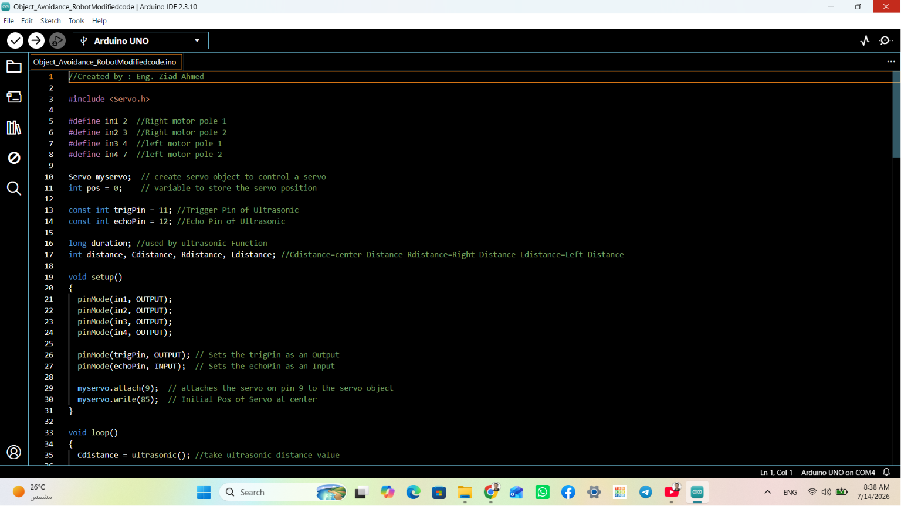

# 🤖 Autonomous Object-Avoidance Robot

A fully functional autonomous robot designed to navigate environments while detecting and avoiding obstacles in real-time.
## 🛠️ Development Gallery

| Phase | Detail |
| :---: | :---: |
| 🚀 Robot Action |  |
| 🛠️ System Setup |  |
| 🧑‍💻 Developer Work |  |

---

  

---

## ⚙️ Technical Documentation

### 🔌 Schematic Layout

  

### 💻 Coding Logic

  

---

## ✉️ Contact & Professional Inquiries
Designed and developed by **Ziad Ahmed**
* **LinkedIn:** [My LinkedIn Profile](https://linkedin.com/in/ziad-ahmed-819906370)
* **Location:** Cairo, Egypt 
